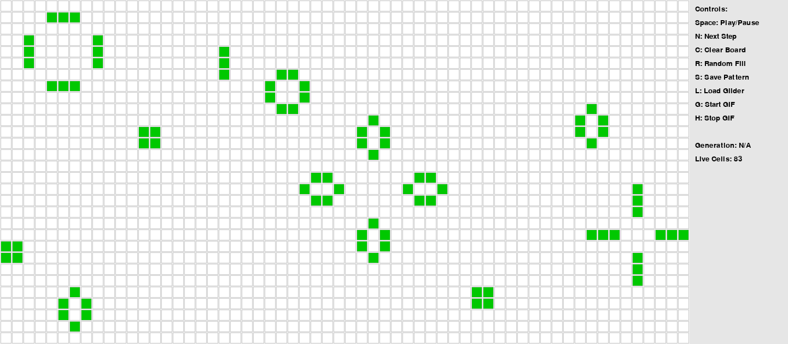

# 🧬 Conway's Game of Life — Python Implementation

Welcome to an interactive and fully-featured implementation of **Conway’s Game of Life** in Python using `pygame`! This project simulates cellular automata with visual animation, real-time controls, save/load features, and GIF generation support.

---

## 📌 Project Overview

**Conway's Game of Life** is a zero-player game devised by mathematician **John Conway**. It evolves based on an initial state according to a set of rules, creating fascinating patterns through simple logic.

---

## 🚀 Features

- Grid-based visual simulation
- Adjustable grid size and FPS via CLI
- Pause/play with next-step support
- Save/load custom patterns (`.txt` format)
- Generate GIFs from live simulation
- Clean modular code with `pygame`
- Built-in Glider pattern loader
- Keyboard control panel

---

## 🧠 Algorithm Used

This uses **Conway's Rules** for updating cells:

1. **Underpopulation:** A live cell with fewer than two live neighbors dies.
2. **Survival:** A live cell with two or three live neighbors lives.
3. **Overpopulation:** A live cell with more than three live neighbors dies.
4. **Reproduction:** A dead cell with exactly three live neighbors becomes alive.

The grid is stored as a 2D list of `0` (dead) and `1` (alive) values. Each frame computes the next state using the rules above.

---

## 📂 Project Structure

```

conway\_game\_of\_life/
│
├── life.py               # Main script to run the game
├── board.py              # Handles grid logic and updating rules
├── draw\.py               # Manages drawing cells, grid, and UI
├── controls.py           # Keyboard input and control handling
├── persistence.py        # Save/load board patterns from .txt
├── gif\_recorder.py       # Records simulation as animated GIF
├── README.md             # Project documentation
├── requirements.txt      # Required Python packages
└── patterns/
├── glider.txt        # Sample glider pattern
└── saved\_pattern.txt # Autosaved custom pattern

````

---

## 🖼 Demo

Here's a preview of the simulation in action:



---

## ⚙️ Requirements

Make sure you have Python 3.x installed. Then, install required packages:

```bash
pip install -r requirements.txt
````

Dependencies:

* `pygame`
* `imageio`

---

## 🛠️ How to Run the Game

### ✅ Step 1: Install Dependencies

```bash
pip install -r requirements.txt
```

### ▶️ Step 2: Run the Main Program

From your project folder, run:

```bash
python life.py --width 60 --height 30 --fps 10
```

You can adjust these options:

* `--width`: Number of cells horizontally (default: 60)
* `--height`: Number of cells vertically (default: 30)
* `--fps`: Frames per second (default: 10)

### 🎮 Step 3: In-Game Controls

| Key       | Action                                                  |
| --------- | ------------------------------------------------------- |
| **Space** | Toggle Play/Pause                                       |
| **N**     | Step forward one generation                             |
| **C**     | Clear the board (all cells dead)                        |
| **R**     | Randomly fill board with live cells                     |
| **S**     | Save current live cells to `patterns/saved_pattern.txt` |
| **L**     | Load live cells from `patterns/saved_pattern.txt`       |
| **G**     | Start/Stop recording a GIF as `simulation.gif`          |

---

## 💾 Saving & Loading Patterns

* **Save:** Press `S` to store the current board state to `patterns/saved_pattern.txt`
* **Load:** Press `L` to restore the board from `patterns/saved_pattern.txt`

---

## 🎥 Generating GIFs

1. Press **G** once to **start recording**
2. Press **G** again to **stop recording**
3. A file named `simulation.gif` will be created in your project folder

---

## 🧪 Sample Pattern

### `patterns/glider.txt`:

```
0,0
1,1
2,-1
2,0
2,1
```

This pattern generates a "glider" — a moving object that travels diagonally across the grid.

---

## 🔗 GitHub Repository

🔗 [https://github.com/LAKSHYAMARODIA01/Conway-s-Game-of-Life](https://github.com/LAKSHYAMARODIA01/Conway-s-Game-of-Life)

Feel free to ⭐ star the repository and contribute!

---

## 👨‍💻 Author

**Lakshya Marodia**  
🔗 [GitHub Profile](https://github.com/LAKSHYAMARODIA01)  
🔗 [LinkedIn Profile](https://www.linkedin.com/in/lakshya-marodia)
